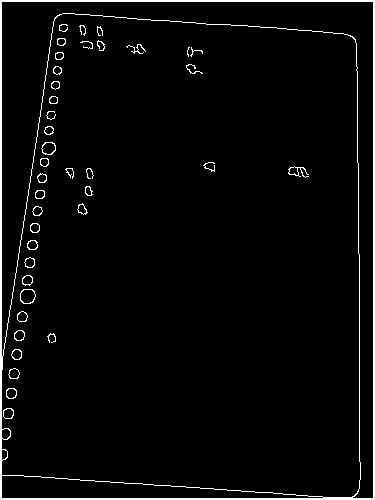
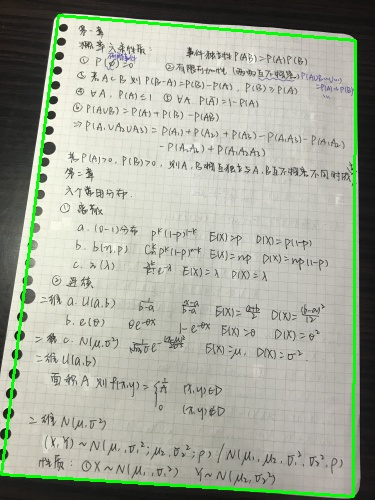
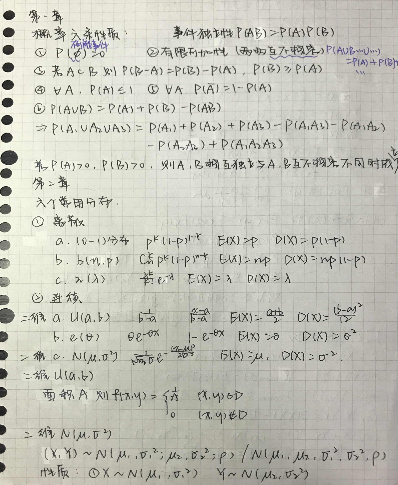
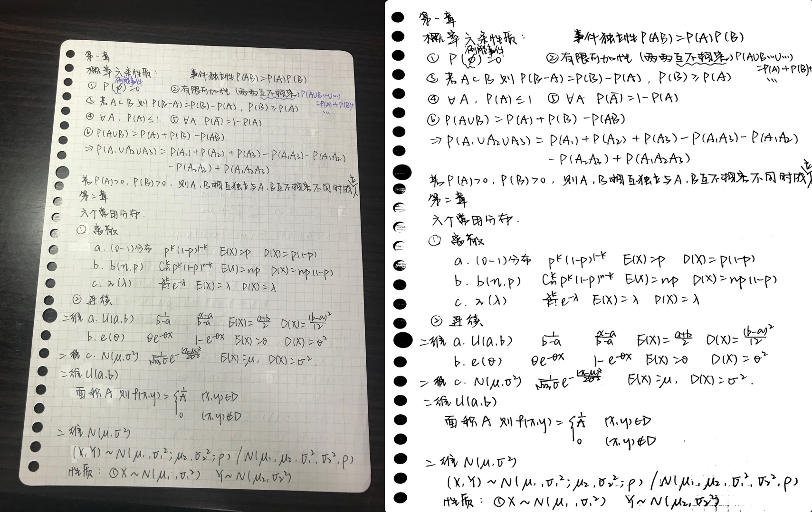
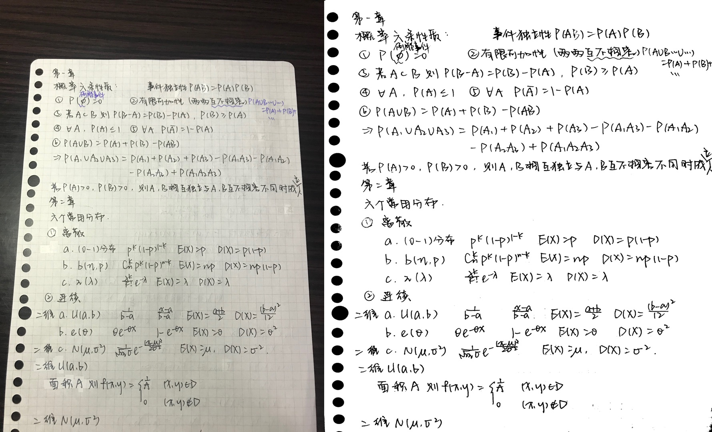
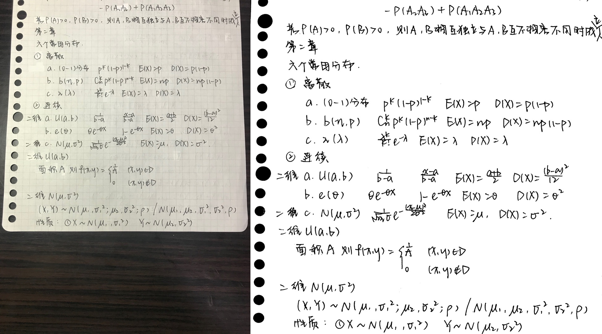
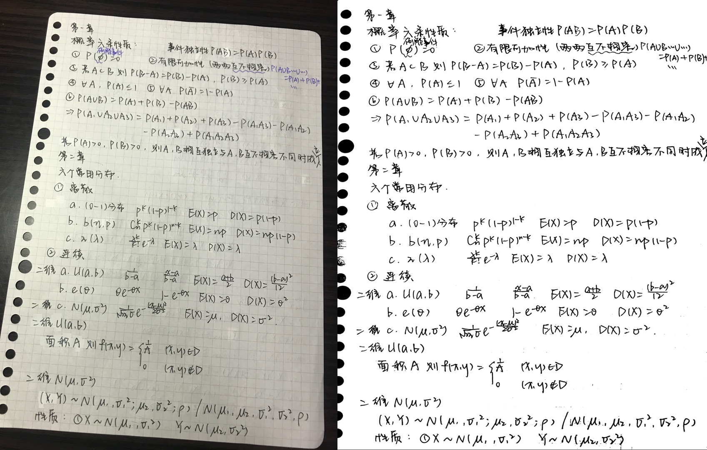
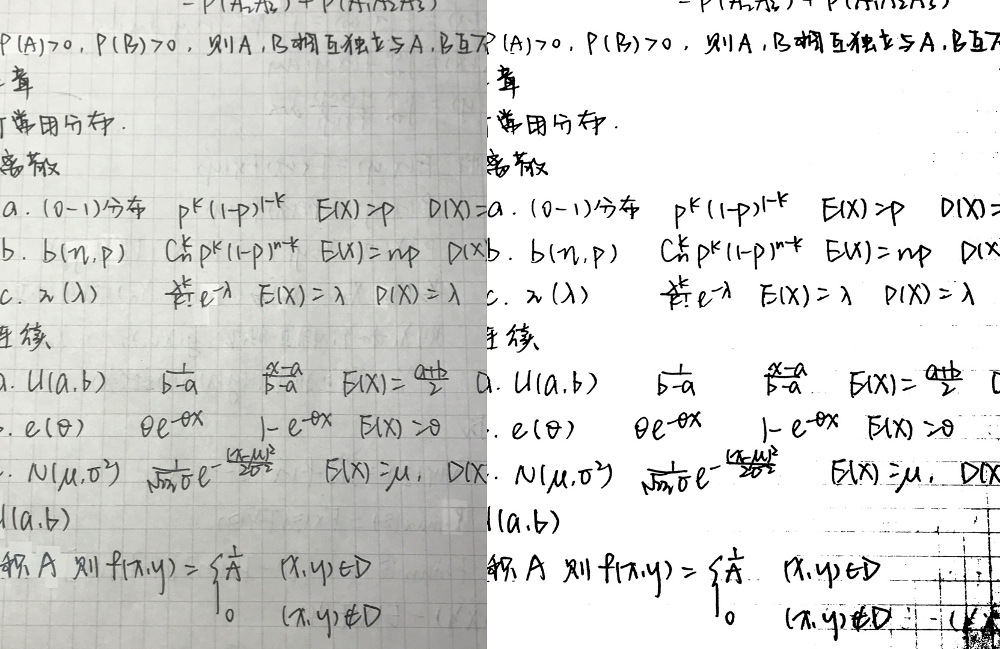
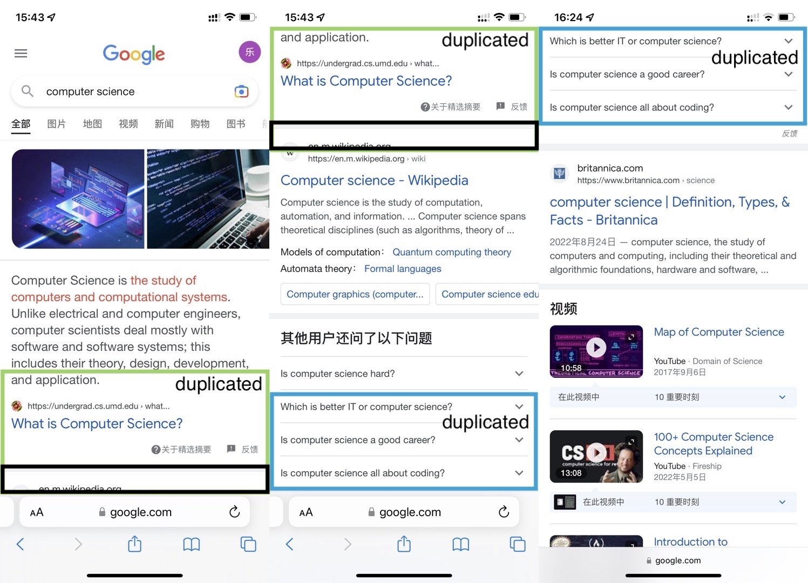

# Image Scanning

1. edge detection

   

2. find contour

   

3. perspective transform

   

4. result

   - situation 1

     

   - situation 2

     

   - situation 3

     

   - situation 4

     

   - situation 5

     

# Image Stitching

Design for screenshot stitching (delete duplicated area)

steps

1. set the minimum height of duplicated area
2. turn input images to gray-scale map
3. compare two images to find the location of duplicated area
   - like two sliding windows (the black rectangle)
   - for image 1, bottom up
   - for image 2, top down
   - find the bottom location
4. find the top location
5. crop the duplicated area and stitch the screenshots

### example

input screenshot

after stitching

